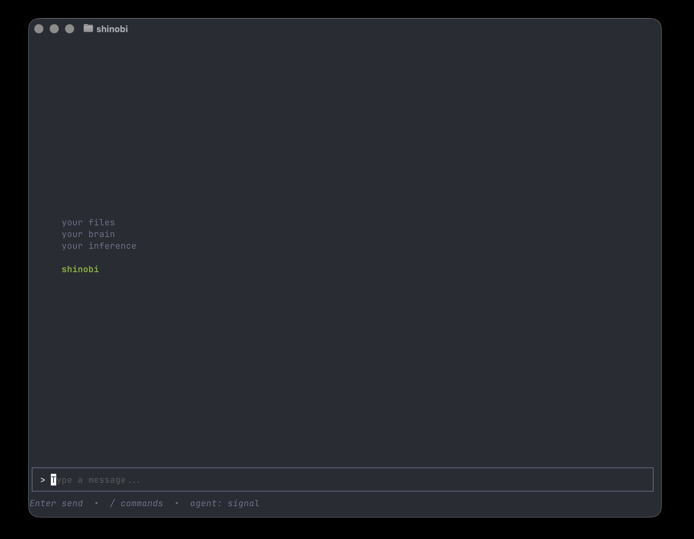
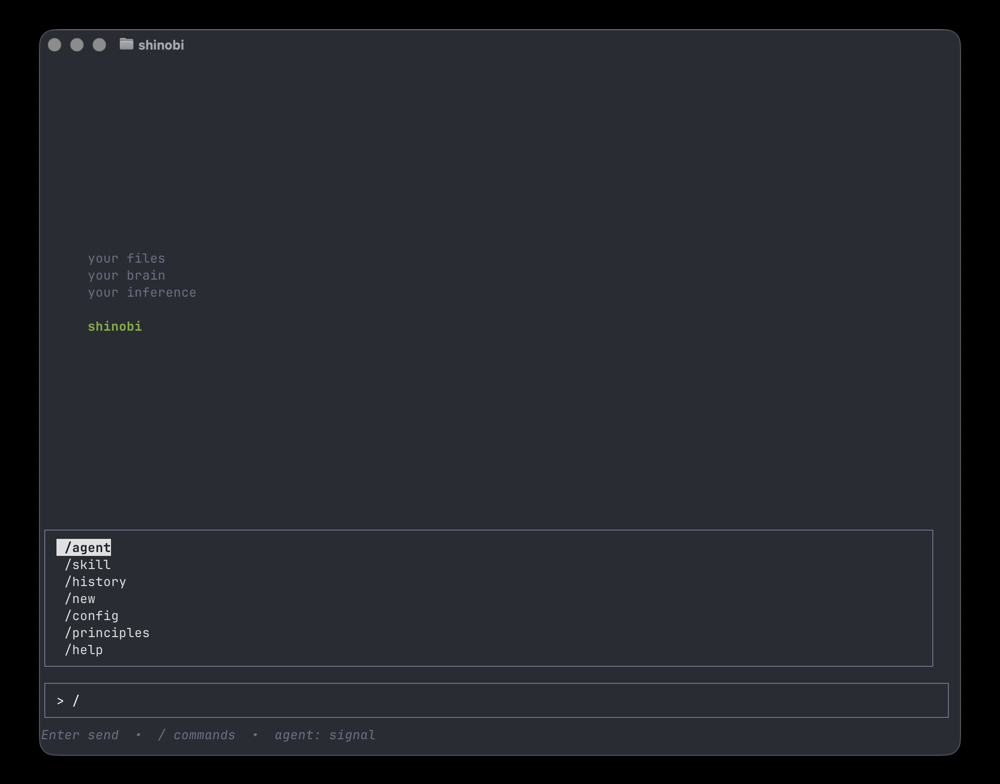
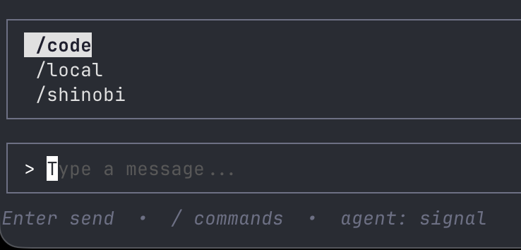
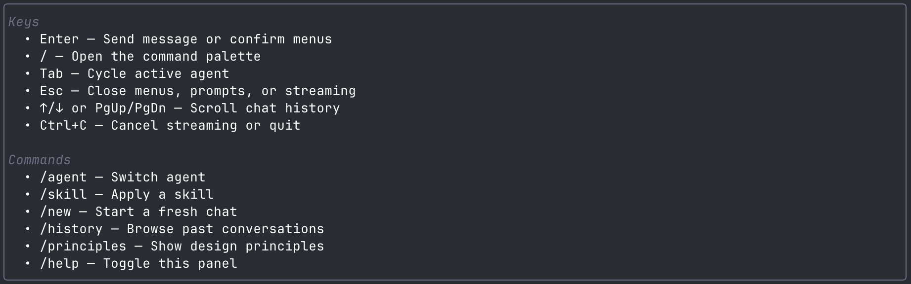
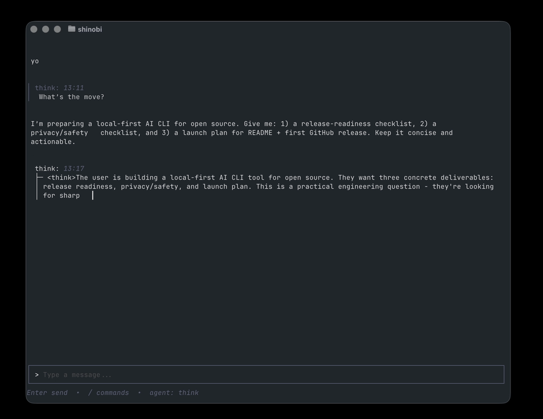

# shinobi

A terminal chat interface for local LLMs.

File over app at the core. Point Shinobi at your existing agent or skill markdown files — no need to modify your filesystem or make duplicates. Configure Shinobi to any folder or Obsidian vault without need for MCP. Use the `/config` command to customize all Shinobi settings to your liking.

Talks to any OpenAI-compatible backend (LM Studio, Ollama, etc.) over a streaming API. Stores conversations in SQLite.

```
your files
your brain
your inference

shinobi
```

## Screenshots

All screenshots and demo media live in `assets/`.







[Watch full streaming demo (mp4)](assets/shinobi-streaming.mp4)

---

## Install

**Requirements:** Go 1.21+

```bash
git clone <repo-url> shinobi
cd shinobi
make install
```

On macOS, Gatekeeper may block the binary. Sign it after install:

```bash
codesign --force --deep --sign - $(which shinobi)
```

---

## Run

```bash
shinobi
```

First run walks you through connecting to a backend. Config is saved to `~/.shinobi/config.yaml`.

---

## Backends

Shinobi supports LM Studio and Ollama. Point it at any OpenAI-compatible endpoint.

**LM Studio** (default): `http://127.0.0.1:1234/v1`
**Ollama**: `http://127.0.0.1:11434/v1`

Both can be configured simultaneously — Shinobi will ask which to use on first run and remember your choice.

---

## Config

`~/.shinobi/config.yaml` — see `config.example.yaml` for a full reference.

```yaml
lmstudio_url: "http://127.0.0.1:1234/v1"
ollama_url: ""

default_model: ""       # Leave empty to auto-select first available model
default_agent: ""       # Agent name to load on startup (optional)

brave_api_key: ""       # Brave Search API key — enables web search tool when set
```

---

## Agents

Agents are markdown files with YAML frontmatter. Drop them in any directory listed under `agent_dirs` in your config.

```markdown
---
name: myagent
description: What this agent does
model: ""          # optional — override the active model for this agent
---
You are Shinobi, a local-first assistant.
```

Built-in example agents ship inside the binary and appear under the `shinobi` group in `/agent`.
Switch agents with `/agent` or press `Tab` when the input is empty.

---

## Skills

Skills are markdown files loaded as system context. They extend or modify the model's behavior for a session.

```markdown
---
name: my-skill
description: What this skill does
---
When responding, always do X.
```

Skills live in any directory you configure under `skills_dir`. Auto-load skills at startup with `auto_load_skills`. Apply mid-session with `/skill`.

Supported skill layouts under `skills_dir`:
- `skills_dir/<skill-name>/SKILL.md` (existing format)
- `skills_dir/<skill-name>.md` (flat-file compatibility)

If both exist for the same skill, `skills_dir/<skill-name>/SKILL.md` takes precedence.
For flat files, frontmatter is optional. Missing `name` falls back to filename, and missing `description` falls back to heading (or name).

---

## Web Search

Set any one search provider key in config — web search is automatically available to the model as a tool.

| Provider | Config key | Notes |
|----------|-----------|-------|
| [Brave](https://brave.com/search/api/) | `brave_api_key` | |
| [Tavily](https://tavily.com) | `tavily_api_key` | Built for AI agents, generous free tier |
| [SerpAPI](https://serpapi.com) | `serpapi_key` | Google results, paid |
| DuckDuckGo | `duckduckgo_enabled: true` | No key required, instant answers only |

If multiple keys are set, priority is Brave → Tavily → SerpAPI → DuckDuckGo.

---

## Commands

| Command | Description |
|---------|-------------|
| `/agent` | Switch agent |
| `/skill` | Apply a skill |
| `/new` | Start a fresh chat |
| `/history` | Browse past conversations |
| `/principles` | Show design principles |
| `/help` | Toggle help panel |
| `/menu` | Open command menu |

---

## Keyboard

| Key | Action |
|-----|--------|
| `Enter` | Send message |
| `/` | Open command menu (press `/` again to close open menus/panels) |
| `Tab` | Cycle agents (when input is empty) |
| `Esc` | Cancel streaming / close menu |
| `Ctrl+C` | Quit |
| `↑` / `↓` | Scroll chat |
| `PgUp` / `PgDn` | Page scroll |

---

## Environment Variables

| Variable | Description |
|----------|-------------|
| `SHINOBI_BACKEND_URL` | Override backend URL |
| `SHINOBI_BACKEND_API_KEY` | Override API key |
| `SHINOBI_AGENT_DIR` | Override agent directories (`:` separated) |
| `SHINOBI_REQUEST_TIMEOUT` | Request timeout in seconds (default: 120) |

---

## Storage

Conversations are saved to `~/.shinobi/conversations.db` (SQLite).

---

## Dependencies

- [Bubble Tea](https://github.com/charmbracelet/bubbletea)
- [Lip Gloss](https://github.com/charmbracelet/lipgloss)
- [Glamour](https://github.com/charmbracelet/glamour)
